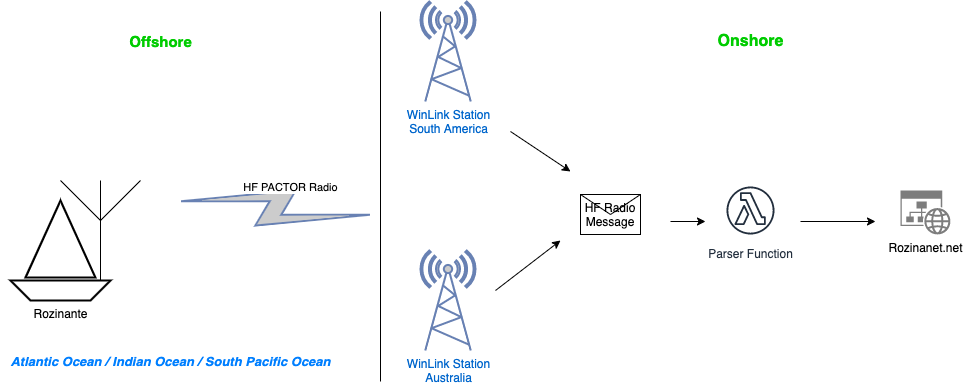
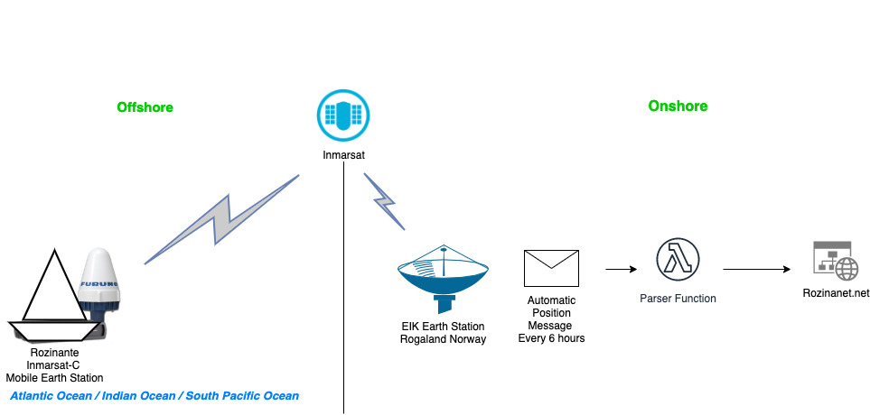
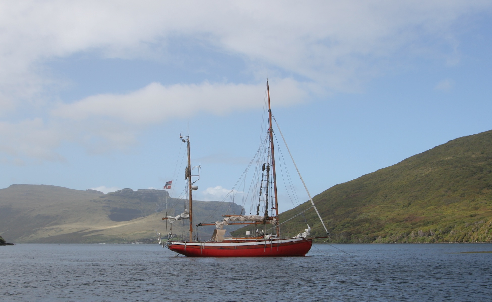

# Rozinante.net Historic Website

Rozinante.net is a historic website named after S/Y Rozinante that was lost at sea by Cape Horn, South America in 2006. The sailing journey is documented in a book unfortunately only available in Norwegian and can be found here: <https://flyt.no/shop/norske-seilere/vaghalsen/>  Github repo contains the original website and necessary code to run the website. The website <http://www.rozinanet.net>

## Background - Historic Technical overview

In the early days of the Internet of Things (IoT) the communication to remote areas was limited to expensive satellite connections and HF Radio. Rozinanet.net was updated multiple times from remote areas, including very close to Point Nemo https://en.wikipedia.org/wiki/Pole_of_inaccessibility over HF Radio using the PACTOR modulation. The speeds that was possible was normally around 250-800 baud. A few pictures was also sent and it could take up to an hour to send a picture of 29Kbyte. The text, pictures, position reports, and other data were sent over HF Radio and backend services parsed the data and published it automatically to the website.

In addition to manual text reports over HF an onboard Inmarsat-C terminal sent position reports every 2-6 hours and updated a map on the website with the latest position and speed using PHP GD Library.txt

The webpage was written in PHP and CSS to generate dynamic html pages running on LAMP stack. Big thanks to https://github.com/hornang

More info see ABOUT.md

### How it worked

Technical Architecture Diagram for Text and Graphics Reports over HF

Technical Architecture Diagram for Automatic Position Reports over Inmarsat

Offshore Equipment:

Installed equipment in Rozinante to communicate and update the website:

- Furuno (NERA) Inmarsat-C MES (Mobile Earth Station)
- ICOM 802 HF SSB Radio
- ICOM AT-140 Antenna Tuner
- 5m 1-30Mhz Whip Antenna
- SCS PACTOR Modem
- NMEA 0183 GPS Unit + Raymarine Seatalk

Position Reports sent over Inmarsat-C can be found here in UNIX Timestamp, Lat/Lon COG and SOG
https://raw.githubusercontent.com/sjobyt/rozinante-net/master/docker/wwwroot/news/positions/positions.txt

Example of an image of 29 kbyte that was sent over HF Radio from the bottom of the world.

One of the last pictures taken of Rozinante at 30th December 2005 on The Auckland Islands 465km south of New Zealand.

## Setup as of March 2021

The website ran for nearly 10 years until January 2021 without any major maintainence at a hosting company on a linux server. In March 2021 the website code and hosting were dockerized and moved to Github, Cloudflare, and AWS.

Setup as of March 2021:

Modifications to original 15-year-old code.

- Added timezone info to PHP Code in functions.php
- Website runs in one container with less than 512MB of Memory.

Domain rozinante.net hosted by <https://kundeweb.agdernett.no/>

- Nameservers in Agdernett point to Cloudflare.
- All infrastructure configuraiton is stored in Terraform in ./iac
- Docker Image is built by Github Action and stored in AWS ECR
- Docker Image is hosted on AWS ECS Fargate with AWS ALB behind Cloudflare WAF and CDN.
- Terraform Code is deployed by Github Actions.

## Github Environments

Github Repo: <https://github.com/sjobyt/rozinante-net>